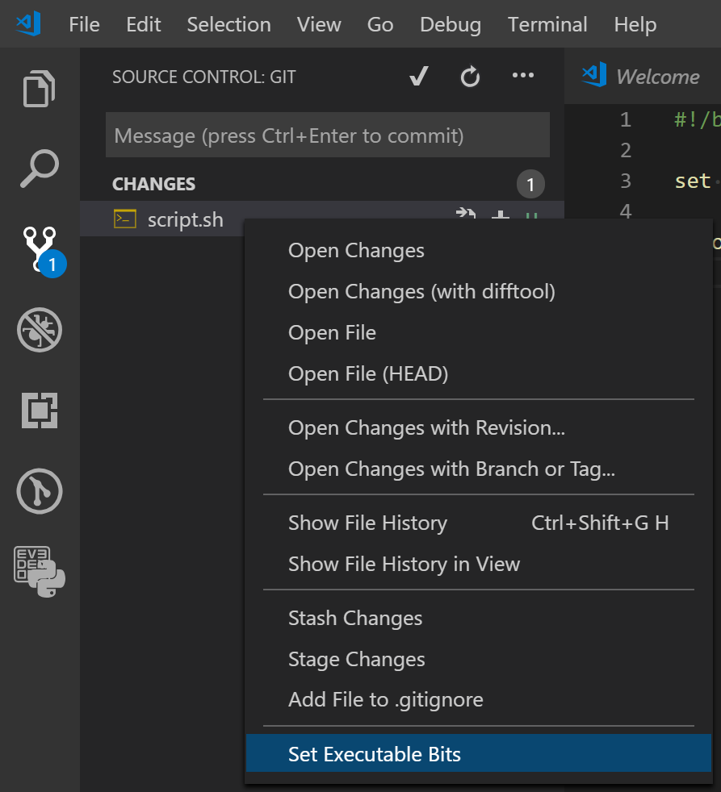

# chmod README

This is a super-simple extension that provides commands equivalent to
`chmod +x` and `chmod -x`.

## Usage

This extension adds a context menu item for setting or clearing the executable
bits on an individual file. Which context menu depends on your operating system.

### Windows

On Windows, use the file context menu in the *Source Control Activity View*.

To clear the executable bits, hold down <kbd>Alt</kbd> or <kbd>Shift</kbd> when
right-clicking.

**NOTE:** Since Windows doesn't have the notion of POSIX file permissions, `git`
is used to add and remove the executable bits. As a side-effect, an untracked
file *must* be added to the git index in order to set the executable bits.

### macOS / Linux

On other operating systems, use the file context menu in the *Explorer Activity
View*. File system permissions are modified just as if running `chmod` in a
terminal.
